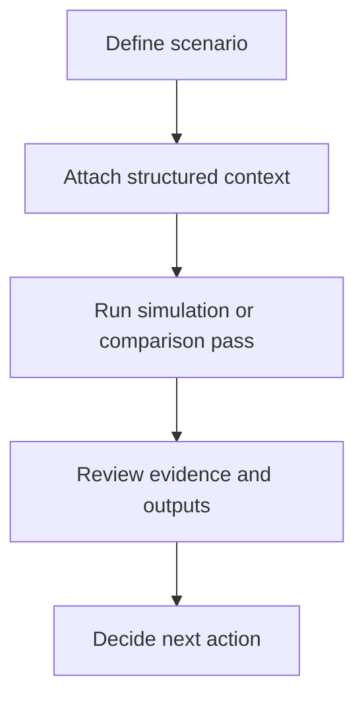

# Workflow

## High-level functional workflow
1. Define scenario
2. Attach structured context
3. Run simulation or comparison pass
4. Review evidence and outputs
5. Decide next action

## Publication boundary
- The workflow is intentionally simplified.
- No internal rules, private thresholds, or sensitive processing detail are described here.
